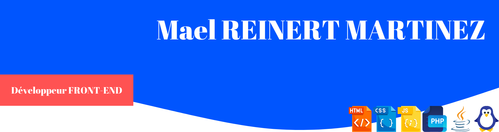

# Maël Reinert Martinez - Portfolio

## 👋 Présentation

Bonjour, je suis Maël Reinert Martinez, un développeur web passionné par la création d'applications innovantes et performantes. Mon expertise couvre principalement le développement front-end avec VueJS, ainsi que le back-end avec Laravel.

## 🚀 Projets phares

### Projet phare : ProvisionalCalendar

**Description**

ProvisionalCalendar est une application innovante de gestion de calendrier conçue pour répondre aux besoins de planification flexible et temporaire. Ce projet vise à simplifier la création et la gestion d’événements provisoires, offrant une solution adaptée aux emplois du temps dynamiques et en constante évolution.

**Technologies utilisées**

- Frontend: VueJS
- Backend: Laravel
- Base de données: MariaDB

**Fonctionnalités principales**

- Création d’événements provisoires avec dates et heures flexibles
- Gestion intelligente des conflits entre événements
- Synchronisation multi-plateformes (desktop, tablette, mobile)
- Notifications personnalisables pour les changements d’horaires

**Défis techniques relevés**

- Implémentation d’un système de verrouillage optimiste pour la gestion de la concurrence
- Optimisation des performances avec techniques de mise en cache et d’indexation
- Conception d’un schéma de base de données flexible pour divers types d’événements

**Lien du projet** : https://github.com/0wme/ProvisionalCalendar

## 💻 Compétences techniques

 - **Languages:**        
  - **Frameworks:**    
  - **Databases:**   
  - **Agile Methods:**  

## 📫 Contact

N'hésitez pas à me contacter pour discuter de collaborations potentielles ou simplement échanger sur le développement web !

- Email: maelreinertmartinez@example.com
- LinkedIn: [maelreinertmartinez](https://www.linkedin.com/in/mael-reinert-martinez-515633217/)
